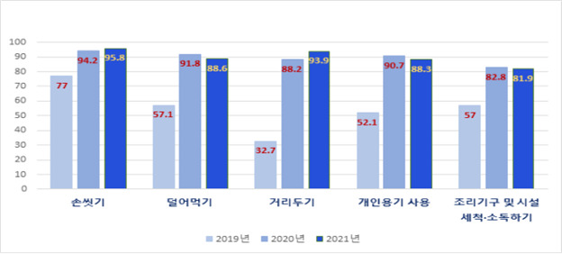
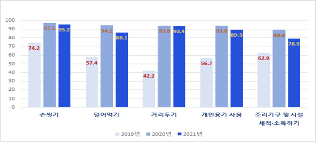
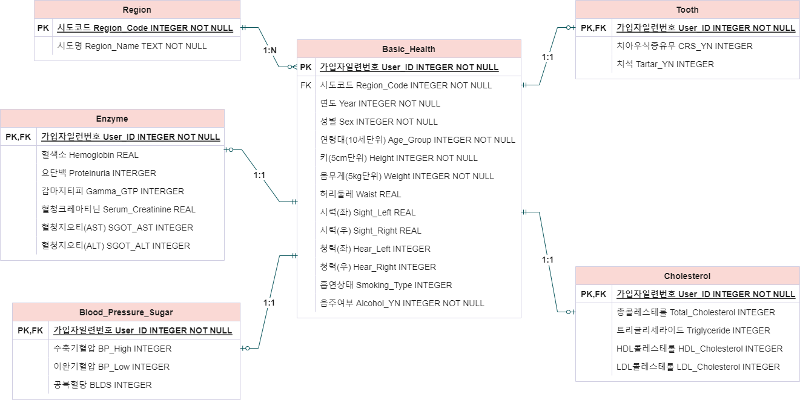
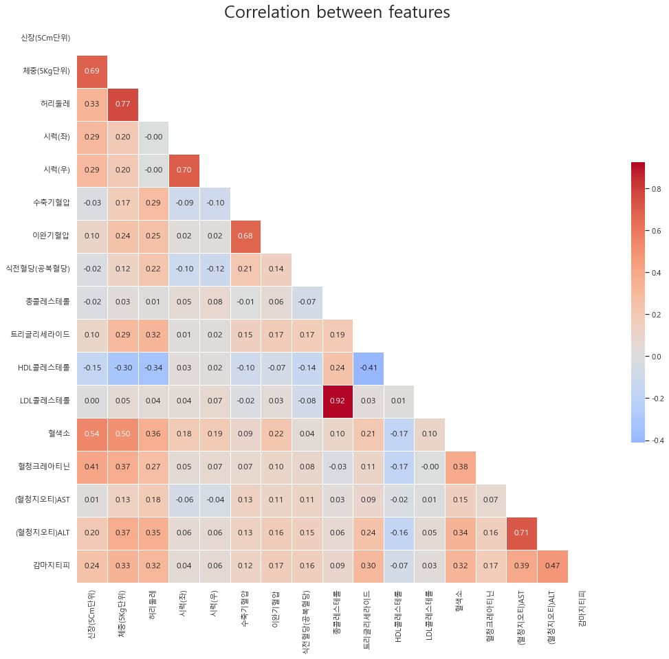
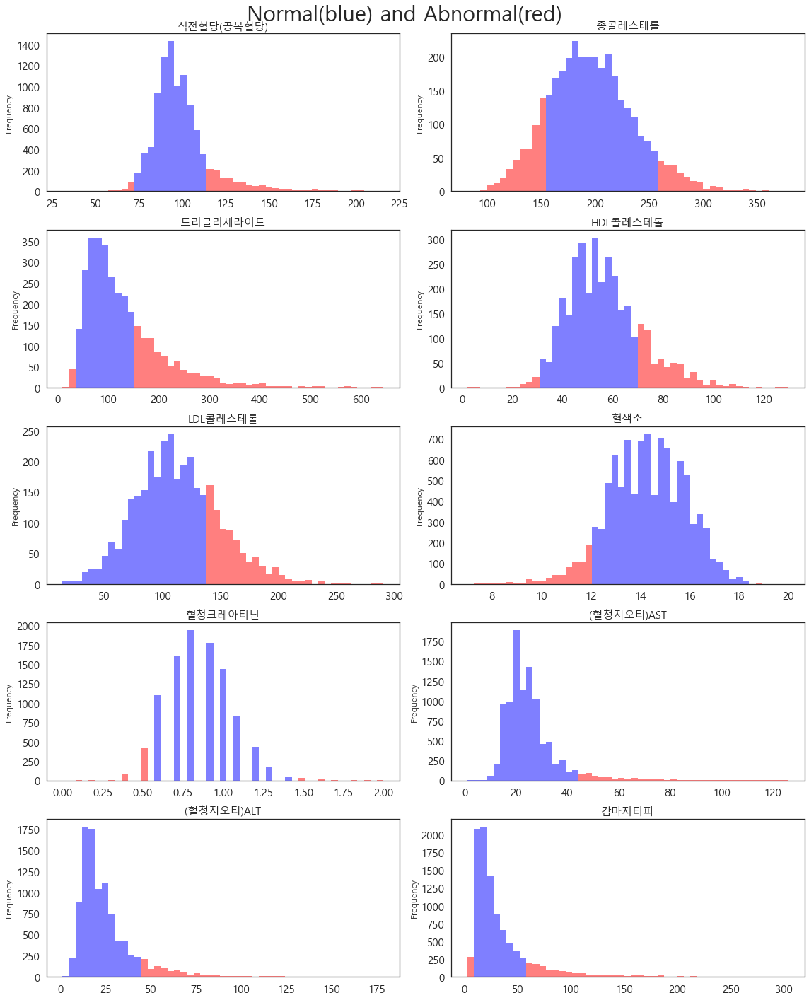

# statistical-database-project

2022 통계데이터베이스 수업 기말프로젝트

국민건강보험공단 건강검진정보 공공데이터를 활용한 통계 분석

## 코로나19로 인한 건강에 대한 관심 증가

- 코로나19 전·후의 생활 속 식생활 안전 ‘인지도’ 

- 코로나19 전·후의 생활 속 식생활 안전 ‘실천도’ 

코로나19로 인해 국민들의 건강에 대한 관심이 커지고 있다. 2021년 11월 10일~15일 전국 만 19세 이상 국민 1,200명을 대상으로 조사한 ‘코로나19 이후의 생활 속 예방 실천도’에 따르면 코로나19 이전과 비교하여 손씻기, 덜어먹기, 개인용기 사용 등 생활 속 ‘식생활 안전’의 ‘인지도’와 ‘실천도’가 항목별로 최소 20%p에서 최대 50%p까지 증가했다.

건강을 위한 실천은 자연스레 본인 건강 상태에 대한 궁금증으로 이어지게 된다. 기본적인 정보인 키, 몸무게, 시력, 청력, 혈압 등등부터 시작하여 소변검사를 통해 알 수 있는 요단백(단백질이 포함된 소변), 혈액검사를 통해 알 수 있는 혈당, 혈색소 등이 존재한다.

건강검진을 받는 이유는 혈액검사와 같이 집에서 측정하기 어려운 항목들 때문일 것인데 이들의 대략적인 수치 또는 정상인지 비정상인지를 판단할 수 있으면 유용할 것이다.

따라서 비교적 자가 측정이 간단한 항목들을 통해 혈액검사 항목(자가 측정이 간단하지 않은 항목)들을 예측하여 사용자의 건강상태를 진단하고자 한다.

## 필요한 데이터 항목

혈액검사 항목 데이터 없이 이를 예측하기 위해 일반건강검진 데이터가 필요하다. 여기서는 공공데이터 포털에서 제공하는 2018년~2019년 국민건강보험공단 건강검진정보 데이터를 사용하겠다. 건강검진정보 데이터는 기준년도, 가입자일련번호, 성별코드, 연령대코드(5세 단위), 시도코드 외 29개 변수를 포함한 총 34개 변수 목록으로 이루어져 있다. 한편, 대부분이 결측치(NA)로 이루어져 있거나 다른 설명변수로 표현되는 구강검진수검여부, 데이터공개일자 외 3개의 변수를 제외하고 2018년, 2019년에서 각각 5000개씩 행을 무작위로 추출하여 10000개 행을 분석에 사용할 것이다.

## 데이터베이스 구조

29개의 검사항목 변수를 속성에 따라서 기본건강정보, 혈압/혈당, 치아, 콜레스테롤, 효소, 지역 총 6개의 테이블로 나누었다. 지역 테이블을 제외한 각 테이블은 가입자일련번호를 기본 키(primary key)로 가진다.

## 시각화

### 상관관계 행렬

위의 상관관계 행렬은 각 변수에서 z-점수의 절대값이 3을 넘어가는 극단값을 제거하고 그린 것이다. 반응변수를 예측하는데 있어 필요한 정보는 다음과 같다. 키와 몸무게, 몸무게와 허리둘레는 강한 양의 상관관계가 존재한다. 총 콜레스테롤과 LDL 콜레스테롤은 다른 변수와의 상관관계가 없어 보인다. 

### 혈액검사항목의 정상 범위와 비정상 범위

정상적인 값(파란색으로 표기)에서 멀어질수록 비정상적인 값(빨간색으로 표기)에 가까워지며 정상 값에서 더 멀어질수록 더욱 비정상적인 값이라고 해석할 수 있다. 트리글리세라이드과 콜레스테롤 관련 변수의 경우 정상 값 구간에 속한 빈도와 비정상 값 구간에 속한 빈도가 7:3정도로 보인다. 반면, 나머지 변수의 경우 비정상 구간이 긴 꼬리에 속하여 적은 수의 빈도를 가진다.

## 예측 모형 생성

시각화 결과 설명변수와 반응변수간의 상관관계가 강하지 않았으며 상관관계가 없는 변수도 존재했다. 이러한 상황에서 반응변수의 값을 유의미한 범위내로 예측하는 것은 매우 어렵다고 볼 수 있다. 사실, 건강검진 검사자의 경우 검진 항목의 수치가 얼마냐 보다는 이 수치가 정상에 속하는지 아니면 비정상에 속하는지가 더 관심사일 것이다. 따라서 반응변수의 값이 얼마인지를 예측하기 보다는 예측값이 정상에 속하는지 비정상에 속하는지를 구분하는 모델을 구성하겠다.

반응변수와의 상관계수가 0에 가깝지 않은 설명변수들을 선택하겠다. 선택한 설명변수는 성별, 연령대, 신장, 체중, 허리둘레, 흡연상태, 수축기혈압, 이완기혈압, 요단백 으로 총 9개이다. 치아우식증 유무와 치석 변수는 결측치가 많아 사용하지 않았다. 반응변수는 총 콜레스테롤, 트리글리세라이드, HDL 콜레스테롤, LDL 콜레스테롤, 공복혈당, 혈색소, 감마지티피, 혈청크레아티닌, 혈청지오티 AST, 혈청지오티 ALT로 혈액검사를 통해 얻을 수 있는 항목이다. 모델의 평가는 F1-score를 사용하겠다.

반응변수가 범주형 변수이므로 로지스틱회귀모형을 사용하겠다. 대부분 사람들의 혈액검사 항목의 수치가 정상에 속하므로 기본적으로 모델이 예측한 비정상일 확률은 낮을 것이다. 따라서 이를 반영하고자 타켓이 1(비정상)일 확률이 0.2보다 높으면 비정상으로 예측했다. 아래는 반응변수에 따른 train data에 대한 모형의 $R^2$와 F1-score를 나타낸 표이다. 

|반응변수|$R^2$|F1-score|
|:-:|:-:|:-:|
|총 콜레스테롤|0.01467|0.2391|
|트리글리세라이드|0.08088|0.5782|
|HDL 콜레스테롤|0.7439|0.4693|
|LDL 콜레스테롤|0.01045|0.4698|
|공복혈당|0.1021|0.4207|
|혈색소|0.09872|0.0089|
|감마지티피|0.04911|0.3331|
|혈청크레아티닌|X|X|
|혈청지오티 AST|0.03897|0.0581|
|혈청지오티 ALT|0.1343|0.4092|

혈청크레아티닌의 경우 모델이 예측을 전혀 하지 못해 제외했다. 각 모델은 p-값이 매우 작아 유의했다. 트리글리세라이드 변수를 제외하면 나머지 변수들에 대해서는 모델의 성능이 좋지 않다.

## 결론

시각화 결과 설명변수와 반응변수간의 상관관계가 강하지 않았으며 상관관계가 없는 변수도 존재했다. 이러한 상황에서 반응변수의 값을 유의미한 범위내로 예측하는 것은 매우 어렵다고 생각하여 반응변수가 정상에 속하는지 비정상에 속하는지를 구분하는 모델을 구성했다. 반응변수가 범주형 변수이므로 로지스틱회귀모형을 사용했고 적합결과, 반응변수가 트리글리세라이드인 모형에서의 F1-score가 제일 좋게 나왔다. 그 외에 반응변수에 대해서는 모델의 성능이 좋지 않았다. 더 좋은 예측 모델을 사용하거나 혈액검사 외의 항목을 기존보다 더 많이 수집하는 방식을 통해 모델의 성능을 향상시킬 수 있을 것이다.   

모델이 잘 예측하지 못하는 반응변수가 존재하지만 이는 큰 문제가 되지 않을 수 있다. 만약, 혈액검사를 받게 된다면 하나의 항목에 대해서만 확인하기 보다는 여러 항목에 대해 종합적으로 확인할 것이다. 따라서 모델의 성능이 가장 좋게 나왔을 때의 반응변수인 트리글리세라이드의 수치가 비정상일 확률이 높게 나온다면 다른 항목들과 같이 혈액검사를 받는 것을 사용자에게 추천할 수 있을 것이다.

## 참고문헌

1. 반경녀 연구관. “식중독 실천 요령(6대수칙) 인지도 87.9%로 높아.” 식품의약품안전처. 2022년 1월 24일. https://www.mfds.go.kr/brd/m_99/view.do?seq=46091
2. 김나현 기자. “꾸준히 감소하는 건강검진 수검률...20·30대 낙폭 최대.” 메디칼업저버. 2021년 10월5일. http://www.monews.co.kr/news/articleView.html?idxno=307502
3. 빅데이터운영실 데이터관리1팀. “국민건강보험공단_건강검진정보.” 국민건강보험공단. 2021년 9월 29일. https://www.data.go.kr/data/15007122/fileData.do
